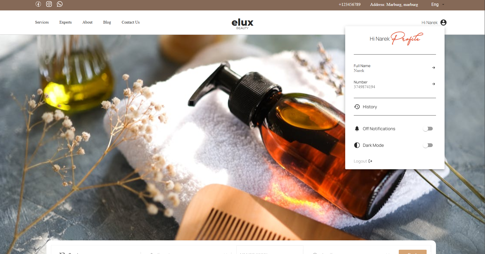
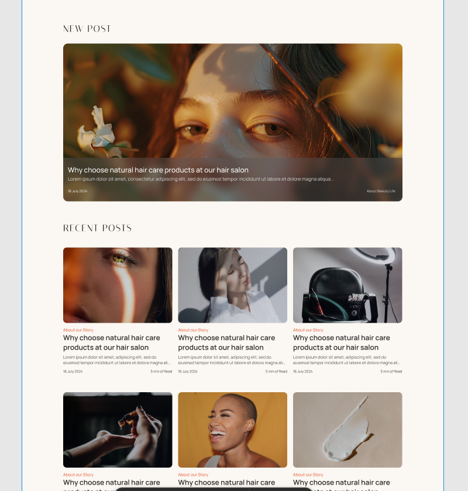

# Eluc-Beauty 💄✨

**Eluc-Beauty** is a frontend e-commerce project (online beauty shop) built with **React** and **Redux**.  
This project demonstrates modern frontend practices, a clean UI, and component-driven architecture.

Status: Working UI prototype. Live demo: (coming soon)

---

## 🚀 Live Demo
Demo: *(coming soon — add deployment URL here when available)*

---

## 🛠️ Tech Stack
- React
- Redux (Redux Toolkit )
- React Router
- Material UI (MUI)
- JavaScript (ES6+)
- HTML, SCSS

---

## ✨ Key Features
- Responsive layout (mobile / tablet / desktop)
- Modern e-commerce UI components (catalog, product page, cart)
- Redux-based state management
- Component-first directory structure
- Reusable and testable components

---
# Project structure 

- src/
  - assets/ — images, icons
  - fonts/ - custom fonts used in the project
  - components/ — application pages and main sections
  - shared UI components - buttons, inputs, modals
  - layouts/ — app layouts (Header, Footer)
  - redux/ — Redux store and slices for state management 
  - services/ — API clients and auth helper
  - utils/ — helpers (formatters, validators)
  - styles/ — global SCSS / theme
  - index.jsx, App.jsx — entry points

---

## 📸 Screenshots
<div align="center">


&nbsp;&nbsp;&nbsp;


<br /><br />



</div>


---


## 📂 Quick Start (Local Development)

1) Clone repository
```bash
git clone https://github.com/Narek223/Eluc-Beauty.git
cd Eluc-Beauty
